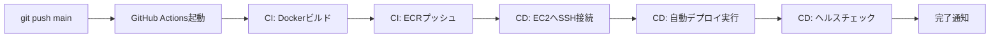

# 更新履歴 - Vibe Aggregator API

## 2025-09-10
### 🔄 /generate-dashboard-summary エンドポイントの大幅改善
- **累積型評価システムに変更**: その時点までのデータのみで総合評価を生成
- **データ構造のシンプル化**: 
  - `integrated_data`カラムを廃止し、`prompt`カラムに変更
  - summaryとvibe_scoreのみを使用するコンパクトな設計
  - 余計なデータ（analysis_result等）を完全に除外
- **プロンプト生成の改善**:
  - timeblock_endpoint.pyスタイルの構成を採用
  - 臨床心理士としての分析依頼形式
  - 2-3文での簡潔な評価を生成
- **データサイズ50%以上削減**: 効率的なデータ保存を実現

## 2025-09-08
### 🆕 ダッシュボード統合機能
- dashboardテーブルの1日分の分析結果を統合（初期バージョン）

## 2025-09-07
### 🆕 ステータス管理機能
- タイムブロック処理後、使用されたデータソースのstatusを自動更新
- vibe_whisper、behavior_yamnet、emotion_opensmileテーブルのstatusカラムを"completed"に更新
- プロンプト生成が成功した場合のみ更新実行
- データが存在しない場合は更新をスキップ

## 2025-09-03
### 🎉 CI/CD完全自動化
- GitHub Actions による自動デプロイパイプライン実装
### 🔧 ARM64対応
- EC2 t4g.small での動作を最適化

### 🔄 完全自動デプロイフロー


## 2025-08-27
### 🔧 重要修正
- 空文字列データの処理を修正 - 「発話なし(0点)」として正しく処理するように改善
### 📈 処理改善
- 処理済みファイル数が5個→25個に大幅改善（欠損データの誤判定を修正）
### 🚨 デプロイ手順強化
- 本番環境デプロイ時の検証プロセスを追加・改善

## 2025-07-15
### 🆕 外部URL公開
- `https://api.hey-watch.me/vibe-aggregator/` で外部からアクセス可能
### ✅ Nginxリバースプロキシ設定
- SSL/HTTPS対応、CORS設定完了
### ✅ マイクロサービス対応
- 他のサービスから簡単にAPI呼び出し可能
### ✅ プロンプト形式更新
- 心理グラフ用JSON生成形式に変更（感情スコア配列、時間軸、統計情報を含む）
### ✅ Systemd統合完了
- EC2での自動起動・常時稼働に対応
### ✅ Supabase統合
- `vibe_whisper`テーブルから読み込み、`vibe_whisper_prompt`テーブルに保存
### ✅ 本番稼働
- EC2（3.24.16.82:8009）で正常稼働中
### ✅ Docker対応
- Docker Composeによる簡単デプロイ

## 2025-07-06
### Supabase統合版テスト結果
**テストデバイス**: `d067d407-cf73-4174-a9c1-d91fb60d64d0`

```bash
# ✅ Supabase統合版テスト
curl "http://localhost:8009/generate-mood-prompt-supabase?device_id=d067d407-cf73-4174-a9c1-d91fb60d64d0&date=2025-07-06"
# → 成功: vibe_whisper_promptテーブルに保存

# ✅ データベース確認
python3 check_result.py
# → 成功: データ保存確認完了
```

**処理結果**:
- 📊 処理ファイル数: 2個
- 📊 欠損ファイル数: 46個
- ✅ プロンプト生成: 正常完了
- ✅ データベース保存: 正常完了