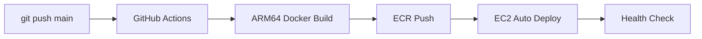

# Vibe Aggregator(Prompt Generator) API | ダッシュボード情報、気分、各種グラフのためのプロンプト生成API

タイムブロック単位、あるいは1日分（48個）のトランスクリプションや音響データを統合し、ChatGPT分析に適したプロンプトを生成するFastAPIアプリケーション

## 🚨 重要: デプロイ方法について

**このAPIは完全自動CI/CDパイプラインで管理されています。**
- ✅ mainブランチへのpushで自動的に本番環境にデプロイ
- ✅ 手動デプロイは不要（GitHub Actions が全て処理）
- ⚠️ 詳細は [CI/CDパイプライン](#cicd-パイプライン) セクションを参照

## 🐳 本番環境情報

- **ECRリポジトリ**: `754724220380.dkr.ecr.ap-southeast-2.amazonaws.com/watchme-api-vibe-aggregator`
- **コンテナ名**: `api_gen_prompt_mood_chart`
- **ポート**: 8009
- **公開URL**: `https://api.hey-watch.me/vibe-aggregator/`
- **デプロイ方式**: GitHub Actions → ECR → EC2（完全自動）

## 🚀 CI/CD パイプライン

### デプロイフロー（完全自動化）



### 開発者がやること

```bash
# 1. コード修正
code main.py

# 2. コミット＆プッシュ（これだけ！）
git add .
git commit -m "feat: 新機能追加"
git push origin main

# 3. 自動デプロイ完了を待つ（約5分）
# GitHub Actions: https://github.com/[your-repo]/actions
```

### CI/CD設定詳細

- **ワークフローファイル**: `.github/workflows/deploy-to-ecr.yml`
- **必要なGitHub Secrets**: 設定済み（AWS認証、EC2接続）
- **アーキテクチャ**: ARM64対応（EC2 t4g.small）
- 詳細: [CI/CDドキュメント](#cicd-パイプライン詳細)

---

## 📋 更新履歴

詳細な更新履歴は [CHANGELOG.md](./CHANGELOG.md) をご覧ください。

## 📋 詳細仕様書

**完全な仕様書**: [`API_DOCUMENTATION.md`](./API_DOCUMENTATION.md) をご参照ください

## 🚀 クイックスタート

### 環境設定

```bash
# .envファイルを作成
cp .env.example .env

# .envファイルを編集してSupabase認証情報を設定
# SUPABASE_URL=https://your-project.supabase.co
# SUPABASE_KEY=your-anon-key
```

### インストール

```bash
# 仮想環境の作成と有効化
python3 -m venv venv
source venv/bin/activate

# 依存関係のインストール
pip install -r requirements.txt
```

### 起動

```bash
uvicorn main:app --host 0.0.0.0 --port 8009 --reload
```

## 📡 APIエンドポイント

### 本番環境URL
**ベースURL**: `https://api.hey-watch.me/vibe-aggregator`

### 利用可能なエンドポイント

#### ヘルスチェック
```bash
curl -X GET "https://api.hey-watch.me/vibe-aggregator/health"
```

#### 1日分統合処理 vibe_whisper_prompt
48個のタイムブロックデータを統合してプロンプトを生成
```bash
curl -X GET "https://api.hey-watch.me/vibe-aggregator/generate-mood-prompt-supabase?device_id=d067d407-cf73-4174-a9c1-d91fb60d64d0&date=2025-07-15"
```

#### タイムブロック単位処理 dashboard
マルチモーダルプロンプト生成（Whisper + YAMNet + OpenSMILE + 観測対象者情報）
```bash
curl -X GET "https://api.hey-watch.me/vibe-aggregator/generate-timeblock-prompt?device_id=9f7d6e27-98c3-4c19-bdfb-f7fda58b9a93&date=2025-09-01&time_block=16-00"
```

#### ダッシュボード統合処理 dashboard_summary
1日分のダッシュボード分析結果を統合して累積評価を生成
```bash
curl -X GET "https://api.hey-watch.me/vibe-aggregator/generate-dashboard-summary?device_id=9f7d6e27-98c3-4c19-bdfb-f7fda58b9a93&date=2025-09-08"
```

### ローカル開発時のURL
開発環境では `http://localhost:8009` を使用してください。

### 成功レスポンス例

```json
{
  "status": "success",
  "message": "プロンプトが正常に生成され、データベースに保存されました。処理済み: 1個、欠損: 47個",
  "output_path": null
}
```


## ✅ 実装完了状況

### ✅ 完了済みエンドポイント

| エンドポイント | 機能 | 出力先 | データソース | ステータス更新 |
|---------------|------|-------------|-------------|--------------|
| `GET /health` | ヘルスチェック | - | - | - |
| `GET /generate-mood-prompt-supabase` | 1日分統合版（48タイムブロック） | vibe_whisper_promptテーブル | vibe_whisper | - |
| `GET /generate-timeblock-prompt` | タイムブロック単位の高精度プロンプト生成 | dashboardテーブル（promptカラム） | vibe_whisper + behavior_yamnet + emotion_opensmile + subjects | ✅ 各テーブルのstatusをcompletedに更新 |
| `GET /generate-dashboard-summary` | 累積型心理状態評価（summaryとvibe_scoreのみ使用） | dashboard_summaryテーブル（promptカラム） | dashboard (status='completed') | - |

### ✅ 実装完了機能

#### 1日分統合処理（/generate-mood-prompt-supabase）
- 48個（24時間分）のトランスクリプション統合処理
- `vibe_whisper`テーブルから読み込み、`vibe_whisper_prompt`テーブルへ保存
- 1日の全体的な心理グラフ生成用

#### タイムブロック単位処理（/generate-timeblock-prompt）
- **30分単位での高精度分析**に特化
- **マルチモーダルデータ統合**:
  - 発話内容（vibe_whisperテーブル）
  - 音響イベント（behavior_yamnetテーブル / YAMNet分類結果）
  - 音声特徴（emotion_opensmileテーブル / OpenSMILE音声特徴）
  - 観測対象者情報（subjectsテーブル / 年齢・性別・備考）
- **コンテキスト重視**:
  - 時間帯判定（早朝/午前/午後/夕方/夜/深夜）
  - 観測対象者の属性を考慮した分析
- **ステータス管理機能**（2025-09-07追加）:
  - プロンプト生成後、使用されたデータソースのstatusを"completed"に自動更新
  - vibe_whisper、behavior_yamnet、emotion_opensmileの各テーブルで実装
  - データが存在する場合のみ更新（欠損データはスキップ）
- **注**: V1エンドポイント（Whisperのみ）は削除済み。V3（OpenSMILE統合版）に統一

#### ダッシュボード統合処理（/generate-dashboard-summary）（更新 2025-09-10）
- **累積型の心理状態評価システム**
- **データソース**: dashboardテーブル（status='completed'のレコード）
- **使用データ（シンプル化）**:
  - 各タイムブロックの`summary`（要約文）
  - 各タイムブロックの`vibe_score`（感情スコア）
  - ※analysis_result等の余計なデータは使用しない
- **プロンプト生成**:
  - その時点までの累積データで評価（例：14:30時点では00:00〜14:30のデータ）
  - timeblock_endpoint.pyスタイルの構造化されたプロンプト
  - 2-3文での簡潔な総合評価
- **出力先**: dashboard_summaryテーブル
  - `prompt`カラム: 生成されたChatGPT用プロンプト
  - `vibe_scores`カラム: 48要素の配列（グラフ描画用）
  - `average_vibe`カラム: 平均感情スコア
  - 同じdevice_id + dateの組み合わせは常に最新版に更新（UPSERT）
- **利用シーン**:
  - その時点での累積的な心理状態の評価
  - 新しいタイムブロックが追加されるたびに上書き更新
  - コンパクトで効率的なデータ保存

### 🔄 WatchMeエコシステムでの位置づけ

#### 1日分統合処理フロー
```
iOS App → Whisper API → vibe_whisper → [このAPI] → vibe_whisper_prompt → ChatGPT API
                                             ↑
                                    プロンプト生成・DB保存
```

#### タイムブロック単位処理フロー
```
vibe_whisper      ┐
behavior_yamnet   ├→ [このAPI] → dashboard (prompt) → ChatGPT API → dashboard (summary/score)
emotion_opensmile ┘      ↓
                     各テーブルのstatus → "completed"
```

#### ダッシュボード統合フロー
```
dashboard (summary + vibe_score) → [このAPI] → dashboard_summary (prompt)
                                        ↑
                            累積型評価プロンプト生成
                            （その時点までのデータのみ）
```

**このAPIの役割**: 
- 1日分統合: vibe_whisperテーブルから読み込み → プロンプト生成 → vibe_whisper_promptテーブルに保存
- タイムブロック処理: vibe_whisper + behavior_yamnet + emotion_opensmileから読み込み → 高精度プロンプト生成 → dashboardテーブルに保存 → 各データソースのstatusを更新
- ダッシュボード統合: dashboardテーブル（completed）のsummaryとvibe_scoreから → 累積型評価プロンプト生成 → dashboard_summaryテーブルのpromptカラムに保存

## 📁 データ構造

### 入力データ

#### vibe_whisperテーブル（発話データ）
- `device_id`: デバイス識別子
- `date`: 日付（YYYY-MM-DD）
- `time_block`: 時間帯（例: "00-00", "00-30"）
- `transcription`: 音声転写テキスト
- `status`: 処理ステータス（"pending" → "completed"）

#### behavior_yamnetテーブル（音響イベントデータ）
- `device_id`: デバイス識別子
- `date`: 日付（YYYY-MM-DD）
- `time_block`: 時間帯（例: "17-00", "17-30"）
- `events`: YAMNet音響分類結果（JSONBフォーマット）
  - `label`: イベント名（英語、例: "Speech", "Water", "Inside, small room"）
  - `prob`: 確率（0.0〜1.0）
- `status`: 処理ステータス（"pending" → "completed"）

#### emotion_opensmileテーブル（音声特徴データ）
- `device_id`: デバイス識別子
- `date`: 日付（YYYY-MM-DD）
- `time_block`: 時間帯（例: "17-00", "17-30"）
- `selected_features_timeline`: OpenSMILE音声特徴の時系列データ（JSONBフォーマット）
  - `timestamp`: タイムスタンプ
  - `features`: 音声特徴（Loudness、Jitterなど）
- `status`: 処理ステータス（"pending" → "completed"）

#### subjectsテーブル（観測対象者情報）
- `subject_id`: 観測対象者ID
- `name`: 名前
- `age`: 年齢
- `gender`: 性別
- `notes`: 備考（学校、趣味など）

#### devicesテーブル（デバイス関連付け）
- `device_id`: デバイス識別子
- `subject_id`: 観測対象者ID（subjectsテーブルと関連）

### 出力データ

#### vibe_whisper_promptテーブル（1日分統合）
- `device_id`: デバイス識別子
- `date`: 日付（YYYY-MM-DD）
- `prompt`: 生成されたChatGPT用プロンプト（心理グラフJSON生成形式）
- `processed_files`: 処理されたレコード数
- `missing_files`: 欠損している時間帯のリスト
- `generated_at`: 生成日時

#### dashboardテーブル（タイムブロック単位）
- `device_id`: デバイス識別子
- `date`: 日付（YYYY-MM-DD）
- `time_block`: 時間帯（例: "17-00"）
- `prompt`: 生成されたプロンプト（マルチモーダル分析用）
- `summary`: ChatGPT分析結果のサマリー（api_gpt_v1で処理後）
- `vibe_score`: 感情スコア（-100〜100、api_gpt_v1で処理後）
- `analysis_result`: ChatGPT分析結果の完全なJSON（api_gpt_v1で処理後）
- `status`: 処理ステータス（"pending" → "completed"）
- `processed_at`: 処理日時
- `created_at`: 作成日時
- `updated_at`: 更新日時

#### dashboard_summaryテーブル
- `device_id`: デバイス識別子
- `date`: 日付（YYYY-MM-DD）
- `prompt`: 生成されたChatGPT用プロンプト（TEXT形式）※旧integrated_dataから変更
  - summaryとvibe_scoreから生成した累積型評価プロンプト
  - その時点までのデータのみを含む
- `vibe_scores`: 感情スコア配列（48要素、グラフ描画用）
- `average_vibe`: 平均感情スコア
- `processed_count`: 処理済みタイムブロック数
- `last_time_block`: 最後に処理されたタイムブロック
- `created_at`: 作成日時
- `updated_at`: 更新日時（同じ日付のデータは常に最新版に更新）

### プロンプト形式の特徴
生成されるプロンプトは、ChatGPTに心理グラフ用のJSONデータを生成させるための専用形式です：
- **timePoints**: 48個の時間点（00:00〜23:30）
- **emotionScores**: -100〜+100の感情スコア配列（欠損はnull）
- **統計情報**: 平均スコア、ポジティブ/ネガティブ/ニュートラルな時間
- **insights**: 1日の心理的傾向の自然文記述
- **emotionChanges**: 感情の大きな変化点

### 🔍 データ状態の区別（重要）

このAPIは、以下の3つの状態を明確に区別して処理します：

| データ状態 | vibe_whisperテーブル | 処理方法 | emotionScores | 意味 |
|-----------|-------------------|----------|--------------|------|
| **発話あり** | transcriptionに文字列あり | テキストを分析 | -100〜+100 | 言語的な情報があり、感情分析可能 |
| **発話なし** | transcriptionが空文字列("") | "(発話なし)"として記録 | **0** | 録音は成功したが言語的な情報なし（咳、雑音、聞き取れない音声など） |
| **データ欠損** | レコードが存在しない(null) | 欠損として記録 | **null** | 録音失敗、システムエラー、未処理など |

#### なぜこの区別が重要か？
- **発話なし（0点）**: 測定は正常に行われたが、言語情報がなかった時間帯。感情的にニュートラルな状態として扱います。
- **データ欠損（null）**: 測定自体が行われなかった時間帯。統計計算から除外されます。

この区別により、心理グラフで「静かに過ごしていた時間」と「測定できなかった時間」を正確に表現できます。

## 🔧 環境変数

| 変数名 | 値 | 説明 |
|--------|-----|------|
| `SUPABASE_URL` | `https://your-project.supabase.co` | SupabaseプロジェクトURL |
| `SUPABASE_KEY` | `your-anon-key` | Supabase Anonymous Key |


## 📊 レスポンス例

### 成功時
```json
{
  "status": "success",
  "message": "プロンプトが正常に生成され、データベースに保存されました。処理済み: 5個、欠損: 43個",
  "output_path": null
}
```

### エラー時
```json
{
  "status": "error",
  "detail": "無効な日付形式です。YYYY-MM-DD形式で入力してください。"
}
```

## 🔄 処理フロー

### Supabase統合処理
1. **vibe_whisperテーブルから読み込み**: 指定device_id、dateのレコードを取得
2. **プロンプト生成**: transcriptionフィールドからテキスト抽出・統合
3. **vibe_whisper_promptテーブルに保存**: UPSERT（既存レコードは更新）

## 🛡️ 堅牢性

- **欠損ファイル対応**: ファイルが存在しない場合でも正常処理
- **空データ対応**: 空のログでも適切なプロンプト生成
- **エラーハンドリング**: 詳細なエラー情報とデバッグ機能
- **権限チェック**: ファイルアクセス権限の事前確認

## 🔧 技術仕様

- **Python**: 3.11.8
- **フレームワーク**: FastAPI
- **非同期処理**: aiohttp
- **データベース**: Supabase (PostgreSQL)
- **ファイル処理**: pathlib
- **ポート**: 8009
- **必須ライブラリ**: fastapi, uvicorn, pydantic, python-multipart, requests, aiohttp, supabase

## 📚 API ドキュメント

- **Swagger UI**: `https://api.hey-watch.me/vibe-aggregator/docs`
- **ReDoc**: `https://api.hey-watch.me/vibe-aggregator/redoc`

ローカル開発環境では `http://localhost:8009/docs` または `http://localhost:8009/redoc` を使用してください。

## 🚢 手動デプロイ手順（CI/CDを使わない場合）

**⚠️ 注意: 通常はCI/CDパイプラインが自動でデプロイするため、以下の手動作業は不要です。**
緊急時やCI/CDが使用できない場合のみ参照してください。

### 前提条件
1. **watchme-networkインフラストラクチャが起動済み**
2. **環境変数ファイル（.env）が配置済み**
   - `/home/ubuntu/watchme-api-vibe-aggregator/.env`
3. **AWS CLIが設定済み**

### デプロイ手順

#### 1. ローカルからECRへのデプロイ

```bash
# プロジェクトディレクトリに移動
cd /Users/kaya.matsumoto/api_gen-prompt_mood-chart_v1

# ECRへイメージをビルド＆プッシュ
./deploy-ecr.sh
```

#### 2. EC2サーバーでのデプロイ

##### 方法1: run-prod.shを使用（推奨）
```bash
# EC2サーバーにSSH接続
ssh -i ~/watchme-key.pem ubuntu@3.24.16.82

# デプロイスクリプトを実行
cd /home/ubuntu/watchme-api-vibe-aggregator
./run-prod.sh
```

##### 方法2: 手動でdocker-composeを使用
```bash
# ECRから最新イメージをプル
aws ecr get-login-password --region ap-southeast-2 | \
  docker login --username AWS --password-stdin \
  754724220380.dkr.ecr.ap-southeast-2.amazonaws.com

docker pull 754724220380.dkr.ecr.ap-southeast-2.amazonaws.com/watchme-api-vibe-aggregator:latest

# コンテナを再起動
docker-compose -f docker-compose.prod.yml down
docker-compose -f docker-compose.prod.yml up -d
```

### 初回セットアップ（新規環境の場合）

```bash
# 1. EC2にディレクトリ作成
ssh -i ~/watchme-key.pem ubuntu@3.24.16.82 'mkdir -p /home/ubuntu/watchme-api-vibe-aggregator'

# 2. 必要なファイルをコピー
scp -i ~/watchme-key.pem docker-compose.prod.yml ubuntu@3.24.16.82:/home/ubuntu/watchme-api-vibe-aggregator/
scp -i ~/watchme-key.pem run-prod.sh ubuntu@3.24.16.82:/home/ubuntu/watchme-api-vibe-aggregator/

# 3. .envファイルを作成
ssh -i ~/watchme-key.pem ubuntu@3.24.16.82
cat > /home/ubuntu/watchme-api-vibe-aggregator/.env << EOF
SUPABASE_URL=your-supabase-url
SUPABASE_KEY=your-supabase-key
EC2_BASE_URL=production
EOF

# 4. デプロイ実行
cd /home/ubuntu/watchme-api-vibe-aggregator
./run-prod.sh
```

### 動作確認

```bash
# ヘルスチェック（内部）
curl http://localhost:8009/health

# ヘルスチェック（外部）
curl https://api.hey-watch.me/vibe-aggregator/health

# コンテナ状態確認
docker ps | grep api_gen_prompt_mood_chart

# ログ確認
docker logs -f api_gen_prompt_mood_chart
```

### デプロイ成功確認（2025年9月3日）

```bash
# コンテナイメージ確認
$ docker inspect api_gen_prompt_mood_chart --format "{{.Config.Image}}"
754724220380.dkr.ecr.ap-southeast-2.amazonaws.com/watchme-api-vibe-aggregator:latest

# 外部アクセス確認
$ curl https://api.hey-watch.me/vibe-aggregator/health
{"status":"healthy","timestamp":"2025-09-03T12:48:06.409480"}
```

## 📖 CI/CD パイプライン詳細

### 🔧 CI/CDの仕組み

#### アーキテクチャ図

```
┌─────────────┐      ┌──────────────┐      ┌─────────┐      ┌──────────┐
│  Developer  │ push │    GitHub    │ auto │ GitHub  │ push │   AWS    │
│   (Local)   │ ───> │ Repository   │ ───> │ Actions │ ───> │   ECR    │
└─────────────┘      └──────────────┘      └─────────┘      └──────────┘
                                                 ↓
                                         ┌──────────────┐
                                         │ Build Docker │
                                         │    Image     │
                                         └──────────────┘

                     ┌──────────────────────────────────────┐
                     │        手動デプロイ（現時点）         │
                     │  EC2サーバーでrun-prod.sh実行        │
                     └──────────────────────────────────────┘
```

### 🚦 CI/CDワークフローの詳細

#### トリガー条件
- **自動実行**: mainブランチへのpush時
- **手動実行**: GitHub ActionsのUIから「Run workflow」

#### 実行ステップ

1. **コードのチェックアウト**
   - リポジトリの最新コードを取得

2. **AWS認証設定**
   - GitHub SecretsからAWS認証情報を取得
   - 一時的なセッションを確立

3. **ECRログイン**
   - AWS ECRへの認証を実行
   - Dockerクライアントを設定

4. **イメージビルド＆プッシュ**
   - `Dockerfile.prod`を使用してビルド
   - 2つのタグでプッシュ:
     - `latest`: 最新版として
     - `git-sha`: コミットハッシュ（履歴管理用）

5. **通知**
   - 成功/失敗をログに記録
   - 次のステップの案内を表示

### 🔐 セキュリティ設定

#### GitHub Secrets（必須設定）

リポジトリの **Settings > Secrets and variables > Actions** で設定:

| シークレット名 | 説明 | 使用場所 |
|--------------|------|---------|
| `AWS_ACCESS_KEY_ID` | AWS IAMユーザーのアクセスキーID | GitHub Actions実行時のみ |
| `AWS_SECRET_ACCESS_KEY` | AWS IAMユーザーのシークレットキー | GitHub Actions実行時のみ |

**重要**: これらのシークレットは暗号化され、GitHub Actions実行時のみアクセス可能

#### IAM権限要件

CI/CD用のIAMユーザーに必要な最小権限:

```json
{
  "Version": "2012-10-17",
  "Statement": [
    {
      "Effect": "Allow",
      "Action": [
        "ecr:GetAuthorizationToken",
        "ecr:BatchCheckLayerAvailability",
        "ecr:GetDownloadUrlForLayer",
        "ecr:PutImage",
        "ecr:InitiateLayerUpload",
        "ecr:UploadLayerPart",
        "ecr:CompleteLayerUpload"
      ],
      "Resource": [
        "arn:aws:ecr:ap-southeast-2:754724220380:repository/watchme-api-vibe-aggregator"
      ]
    }
  ]
}
```

### 📝 詳細な使用手順

#### 初回セットアップ（一度だけ）

1. **GitHub Secretsの設定**
   ```
   1. https://github.com/[your-username]/api_gen-prompt_mood-chart_v1 を開く
   2. Settings → Secrets and variables → Actions
   3. "New repository secret"をクリック
   4. AWS_ACCESS_KEY_ID を追加
   5. AWS_SECRET_ACCESS_KEY を追加
   ```

2. **動作確認**
   ```bash
   # テスト用の小さな変更
   echo "# CI/CD test" >> README.md
   git add README.md
   git commit -m "test: CI/CD pipeline"
   git push origin main
   
   # GitHub Actionsタブで実行状況を確認
   ```

#### 通常のデプロイフロー

```bash
# 1. 開発作業
code main.py  # コード修正

# 2. コミット＆プッシュ（CI/CDトリガー）
git add .
git commit -m "feat: 新機能追加"
git push origin main

# 3. GitHub Actionsの確認（ブラウザ）
# https://github.com/[your-username]/api_gen-prompt_mood-chart_v1/actions

# 4. EC2で本番デプロイ（手動）
ssh -i ~/watchme-key.pem ubuntu@3.24.16.82
cd /home/ubuntu/watchme-api-vibe-aggregator
./run-prod.sh
```

### 🎯 CI/CDパイプラインの範囲

#### 完全自動化された部分 ✅
- コード変更の検知（mainブランチへのpush）
- Dockerイメージのビルド
- ECRへのイメージプッシュ
- **EC2への自動デプロイ** ← NEW!
- ヘルスチェック確認
- デプロイ履歴の記録

#### CD（継続的デプロイ）の追加設定

**追加で必要なGitHub Secrets:**

| シークレット名 | 説明 | 設定値 |
|--------------|------|--------|
| `EC2_SSH_PRIVATE_KEY` | SSH秘密鍵 | watchme-key.pemの内容 |
| `EC2_HOST` | EC2のIPアドレス | `3.24.16.82` |
| `EC2_USER` | EC2ユーザー名 | `ubuntu` |

詳細な設定手順: [SETUP_CD_GITHUB_SECRETS.md](./SETUP_CD_GITHUB_SECRETS.md)


### 🔍 トラブルシューティング

#### よくある問題と解決方法

| エラー | 原因 | 解決方法 |
|-------|------|---------|
| `Invalid AWS credentials` | シークレットが未設定/誤り | GitHub Secretsを再確認 |
| `Repository does not exist` | ECRリポジトリがない | AWSコンソールでECR確認 |
| `no basic auth credentials` | ECRログイン失敗 | IAM権限を確認 |
| `Dockerfile.prod not found` | ファイルが存在しない | リポジトリ構成を確認 |

#### デバッグ方法

1. **GitHub Actionsログの確認**
   - Actionsタブ → 失敗したワークフロー → 詳細表示

2. **ローカルでのテスト**
   ```bash
   # ローカルでDockerビルドをテスト
   docker build -f Dockerfile.prod -t test-image .
   ```

3. **AWS CLIでの確認**
   ```bash
   # ECRリポジトリの存在確認
   aws ecr describe-repositories --repository-names watchme-api-vibe-aggregator
   ```

### 📚 関連ファイル

- **`.github/workflows/deploy-to-ecr.yml`**: CI/CDワークフロー定義
- **`SETUP_GITHUB_SECRETS.md`**: シークレット設定の詳細ガイド
- **`Dockerfile.prod`**: 本番用Dockerイメージ定義
- **`deploy-ecr.sh`**: ローカル用デプロイスクリプト（CI/CDと同等の処理）

---

## 🐛 トラブルシューティング

### よくある問題と解決方法

| 問題 | 原因 | 解決方法 |
|------|------|----------|
| **Invalid API key** | Supabase認証情報が無効 | .envファイルのSUPABASE_URLとSUPABASE_KEYを確認 |
| **Address already in use** | 既存のプロセスが動作中 | `sudo systemctl stop mood-chart-api` でサービスを停止 |
| **データが見つからない** | 指定日付のデータが存在しない | vibe_whisperテーブルにデータが存在するか確認 |
| **ModuleNotFoundError: supabase** | Supabaseライブラリバージョンの不一致 | requirements.txtでsupabase==2.0.0を指定 |
| **JSON解析エラー** | ChatGPTレスポンスの形式不正 | JSON部分を抽出して安全に解析（JSONDecodeError対策） |
| **レート制限エラー** | API呼び出し頻度が高い | 指数バックオフでリトライ処理を実装 |

### デバッグコマンド

```bash
# Dockerコンテナの状態確認
docker-compose ps

# Dockerコンテナのログ確認
docker-compose logs -f

# コンテナ内に入って調査
docker exec -it api_gen_prompt_mood_chart bash

# API直接テスト（EC2上で）
curl -X GET "http://localhost:8009/generate-mood-prompt-supabase?device_id=d067d407-cf73-4174-a9c1-d91fb60d64d0&date=2025-07-14"

# デバッグ用スクリプト（利用可能）
python3 check_rls_issue.py  # RLS問題の診断
python3 test_direct.py       # データ取得テスト
```

## 🤝 Streamlit連携

```python
import requests
import streamlit as st

# 本番環境での使用
base_url = "https://api.hey-watch.me/vibe-aggregator"

# API呼び出し
response = requests.get(
    f"{base_url}/generate-mood-prompt-supabase",
    params={"device_id": device_id, "date": date}
)

if response.status_code == 200:
    result = response.json()
    st.success(f"✅ プロンプト生成完了")
    st.json(result)
else:
    st.error(f"❌ エラー: {response.text}")
```

## 🔗 マイクロサービス統合

### 外部サービスからの利用方法

```python
import requests
import asyncio
import aiohttp

# 同期版
def generate_mood_prompt(device_id: str, date: str):
    url = "https://api.hey-watch.me/vibe-aggregator/generate-mood-prompt-supabase"
    params = {"device_id": device_id, "date": date}
    
    response = requests.get(url, params=params)
    if response.status_code == 200:
        return response.json()
    else:
        raise Exception(f"API Error: {response.text}")

# 非同期版（推奨）
async def generate_mood_prompt_async(device_id: str, date: str):
    url = "https://api.hey-watch.me/vibe-aggregator/generate-mood-prompt-supabase"
    params = {"device_id": device_id, "date": date}
    
    async with aiohttp.ClientSession() as session:
        async with session.get(url, params=params) as response:
            if response.status == 200:
                return await response.json()
            else:
                raise Exception(f"API Error: {await response.text()}")

# レート制限対応版
async def generate_prompt_with_retry(device_id: str, date: str, max_retries: int = 3):
    for attempt in range(max_retries):
        try:
            return await generate_mood_prompt_async(device_id, date)
        except Exception as e:
            if "rate_limit" in str(e).lower() and attempt < max_retries - 1:
                wait_time = (2 ** attempt) * 60  # 指数バックオフ
                await asyncio.sleep(wait_time)
                continue
            raise e

# 使用例
result = generate_mood_prompt("d067d407-cf73-4174-a9c1-d91fb60d64d0", "2025-07-15")
print(result)
```


### セキュリティ設定

- ✅ HTTPS対応（SSL証明書あり）
- ✅ CORS設定済み
- ✅ 適切なヘッダー設定
- ✅ レート制限対応（Nginxレベル）
